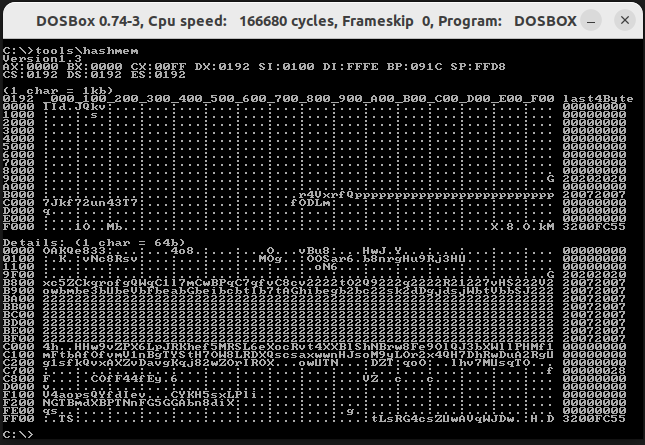

# sizecoding-tools

##### Motivation

I released an [effect](https://demozoo.org/productions/338017/) that under some circumstances did not work as expected, probably because it depends on the initial state of the memory when starting DosBox.

When talking about this with [hannu](https://demozoo.org/sceners/130104/), he mentioned him researching the different initial memory states in all the possible execution environments for DOS code (like Dosbox, Dosbox-stagging, Dosbox-x, FreeDos, ... in all their different versions and host OSes).

So I thought a tool for being able to look at the contents of the memory might be helpful.

## hashmem (version 1.3)

Displays a map of hashes of the first 1MB of memory in chunks of 1kb blocks and all non zero blocks in a 64byte-detailed view.
This is useful to compare the initial state of DOS environments.

#### Visuals

- Version of hashmem.
- Initial values of registers.
- You see 1MB of memory in tabular form.
  - Each of the 16 rows spans 64kb of memory.
  - Each line shows it starting segment address and then prints 64 hashes (1 char per hash) that each represent 1kb of memory.
  - If the 1kb block of memory is completely filled with zeros the hash shows '.' or ':', otherwise it shows one of 0-9, a-z or A-Z.
  - Most of memory is filled with zeros.
  - At the end of each line the last 4 bytes of the 64kb segment are shown plain.
  - Upper left corner shows the segment the code of `hashmem.com` is loaded to. So the hash of this 4kb patch (and the one a row below that, cause of the stack) is influenced by the code that is executed and does not necessarily stem from environmental differences.
- "Details" - show a detailed view of all 4kb patches, that did contain at least one non-zero byte.
  - the length of this view may vary
  - the layout of each line is the same as in the first overview part, only now one char does represent a 64 byte block and not a 1kb block

#### Observations in Dosbox

- Graphics memory at 0xA000 is completely filled with zeros.
- The first page (4kb) of textmode memory at 0xB800 is different every time, because the tool itself is actively writing on the screen.
- The other pages of textmode memory are all the same but not zero.
- In consecutive executions of this tool in the same environment only three of the 4kb patches change:
  - 0x0000: Does change by time (maybe timer at 0x46C). You can see a blinking pixel using `showmem.com`.
  - 0x0100: Does also change by time (no clue why). You can see several wildly blinking memory locations there (see `showmem.com` below). This 4kb page also contains the loaded programm, but as long as the version of code does not change it should not influence the hash of this page.
  - 0xB800: Screencontent is different every time, because of changes in 0x0000 and 0x0100 -> so hash changes.

#### Maps of common platforms

see [SAMPLES.md](SAMPLES.md) and [samples/](samples/) for known memory-hash-maps dosbox installations.

## showmem (version 1.0)

Scrolls through all of 16x64k (= 1MB) of memory accessible by the combination of segment and offset register like [es:di].

#### Controls

ESC => You can pause and resume the scrolling by pressing ESC.

#### Possible future features

- scrolling by arrow keys and page-up and -down keys
- printing hashes for stripes of memory to make them comparable between different environments

#### Visuals

- every line shows 256 byte of memory

- the mode13h default palette is used (0 = black, 1 = blue, 2 = green, ...)

- those 256 byte are followed by a byte that shows the "line-number" modulo 256 as a colored pixel

- the rest of the line is filled with the color representing the number of the current 64k segment of memory

  - 0 = 0x0000:0000 - 0x0FFF:FFFF (black)
  - 1 = 0x1000:0000 - 0x1FFF:FFFF (blue)
  - 2 = 0x2000:0000 - 0x2FFF:FFFF (green)
  - 3 = 0x3000:0000 - 0x3FFF:FFFF (cyan)
  - 4 = 0x4000:0000 - 0x4FFF:FFFF (red)
  - 5 = 0x5000:0000 - 0x5FFF:FFFF (magenta)
  - 6 = 0x6000:0000 - 0x6FFF:FFFF (brown)
  - 7 = 0x7000:0000 - 0x7FFF:FFFF (light gray)
  - 8 = 0x8000:0000 - 0x8FFF:FFFF (dark gray)
  - 9 = 0x9000:0000 - 0x9FFF:FFFF (bright blue)
  - A = 0xA000:0000 - 0xAFFF:FFFF (bright green)
  - B = 0xB000:0000 - 0xBFFF:FFFF (brigth cyan)
  - C = 0xC000:0000 - 0xCFFF:FFFF (bright red)
  - D = 0xD000:0000 - 0xDFFF:FFFF (bright magenta)
  - E = 0xE000:0000 - 0xEFFF:FFFF (yellow)
  - F = 0xF000:0000 - 0xFFFF:FFFF (white)

