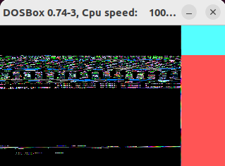

# sizecoding-tools

tools I created to aid sizecoding

## showmem (version 1.0)

Scrolls through all of 16x64k (= 1MB) of memory accessible by the combination of segment and offset register like [es:di].

#### Controls

ESC => You can pause and resume the scrolling by pressing ESC.

#### Motivation

I released an [effect](https://demozoo.org/productions/338017/) that under some circumstances did not work as expected, probably because it depends on the initial state of the memory when starting DosBox.

When talking about this with [hannu](https://demozoo.org/sceners/130104/), he mentioned him researching the different initial memory states in all the possible execution environments for DOS code (like Dosbox, Dosbox-stagging, Dosbox-x, FreeDos, ... in all their different versions and host OSes).

So I thought a tool for being able to look at the contents of the memory might be helpful.

#### Possible future features

- scrolling by arrow keys and page-up and -down keys
- printing hashes for stripes of memory to make them comparable between different environments

#### Visuals

- every line shows 256 byte of memory

- the mode13h default palette is used (0 = black, 1 = blue, 2 = green, ...)

- those 256 byte are followed by a byte that shows the "line-number" modulo 256 as a colored pixel

- the rest of the line is filled with the color representing the number of the current 64k segment of memory

  - 0 = 0x0000:0000 - 0x0FFF:FFFF (black)
  - 1 = 0x1000:0000 - 0x1FFF:FFFF (blue)
  - 2 = 0x2000:0000 - 0x2FFF:FFFF (green)
  - 3 = 0x3000:0000 - 0x3FFF:FFFF (cyan)
  - 4 = 0x4000:0000 - 0x4FFF:FFFF (red)
  - 5 = 0x5000:0000 - 0x5FFF:FFFF (magenta)
  - 6 = 0x6000:0000 - 0x6FFF:FFFF (brown)
  - 7 = 0x7000:0000 - 0x7FFF:FFFF (light gray)
  - 8 = 0x8000:0000 - 0x8FFF:FFFF (dark gray)
  - 9 = 0x9000:0000 - 0x9FFF:FFFF (bright blue)
  - A = 0xA000:0000 - 0xAFFF:FFFF (bright green)
  - B = 0xB000:0000 - 0xBFFF:FFFF (brigth cyan)
  - C = 0xC000:0000 - 0xCFFF:FFFF (bright red)
  - D = 0xD000:0000 - 0xDFFF:FFFF (bright magenta)
  - E = 0xE000:0000 - 0xEFFF:FFFF (yellow)
  - F = 0xF000:0000 - 0xFFFF:FFFF (white)

