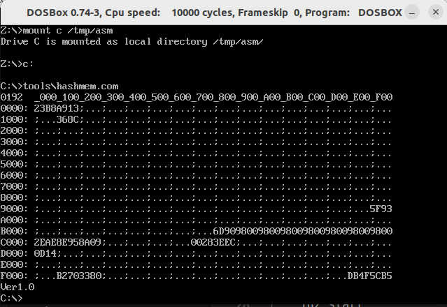
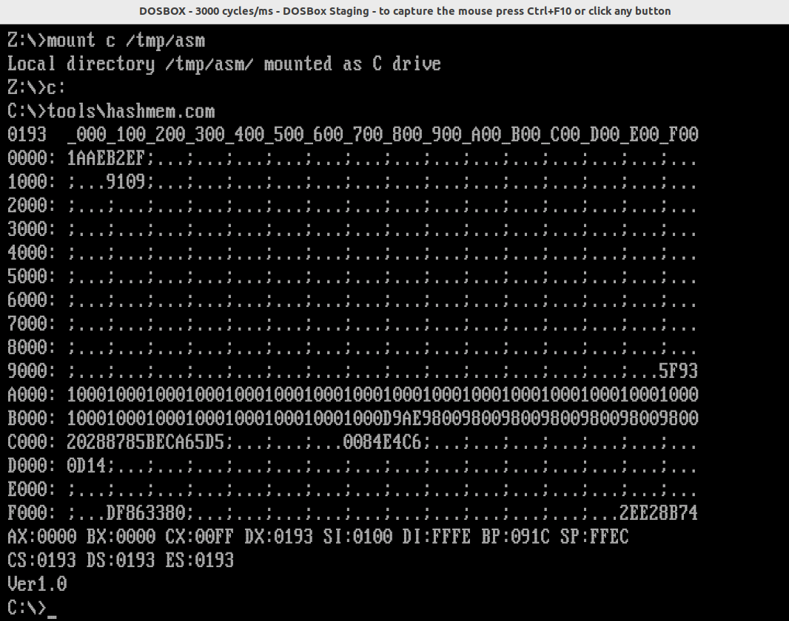

# Initial memory state hashes

### Setup

- `hashmem.com` version 1.0 (built on 17.2.2024)
- started directly via `dosbox -c hashmem.com`

| Memory hashes                                               | Setup                                                                         |
| ----------------------------------------------------------- | ----------------------------------------------------------------------------- |
|  | - dosbox/jammy, now 0.74-3-4 amd64 - Ubuntu 22.04 LTS - dosbox from apt |
|       | - dosbox-staging version 0.81.0 - Ubuntu 22.04 LTS                         |
